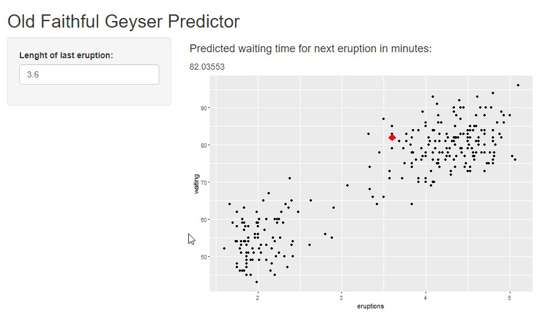

```{r setup, include=FALSE}
knitr::opts_chunk$set(echo = TRUE, message = FALSE, warning = FALSE)
```

## Faithful Prediction App

The **Faithful Prediction App** predicts waiting times for the next eruption of old faithful given the length of the previous eruption.

The app allows you to select the lenght of the last eruption and will show you the waiting time in minutes to the next eruption in text format as well as in a graph in comparison to historical data.

## Faithful Dataset

As base dataset for the prediction model the *faithful* dataset from R was used.
This dataset contains columns as following

- **eruptions** Length of last eruption in minutes
- **waiting** Waiting time for next eruption in minutes
```{r faithful, echo = FALSE}
library(ggplot2)
ggplot(data=faithful, aes(eruptions, waiting)) + 
            geom_point()
```

## Prediction Model

Due to performance reasons of *shinyapps.io* a simple linear regression model was selected.
```{r preditionModel}
library(caret)

model <- train(waiting ~., data = faithful, method='lm')
model$finalModel
```

## Faithful Prediction App



